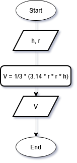

### 1. The Mathematical Formula

I chose is to design an algorithm for calculating the total volume ($V$) of a right circular cone.

The formula is:

$$V = \frac{1}{3} \pi r^2 h$$
Where:
- $V$ = Volume
- $r$ = Radius of the circular base
- $h$ = Height of the cone
- $\pi$ = Constant (approx. `3.14159`)

```cpp
include <iostream>

int main()
{
	cout << conVolume(10.f, 20.f) << endl;
	return 0;
}

float coneVolume (float r, float h)
{
	float pi = 3.14159;
	float v = 1/3 * (pi * r * r * h);
	
	return v;
}
```

### Flowchart
